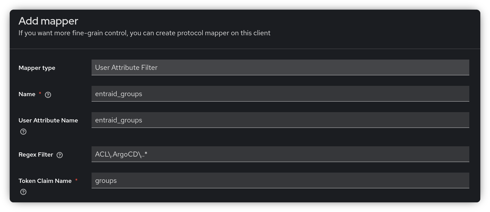
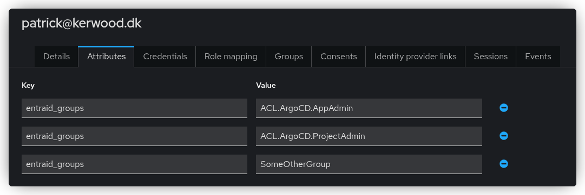

# keycloak-user-attribute-filter
A custom Keycloak protocol mapper that adds user attributes to OIDC token claims, with support for filtering values using regular expressions.

Setting up a generic SAML federation in Keycloak with another identity provider has some drawbacks.
For example, if you want all group claims from the third-party IdP to be included in your access token,
as described in [this blog post](https://linuxblog.xyz/posts/keycloak-entraid-saml-federation/), you don’t have fine-grained control over filtering.
This can result in oversized access tokens and may inadvertently expose your group memberships to all applications using Keycloak.

This protocol mapper allows you to specify a user attribute and a regular expression to filter its values.
The remaining values are then applied to the selected claim.



With the attributes below configured on a user, only the Argo CD admin groups will appear in the access token.



```json
{
  "groups": [
    "ACL.ArgoCD.AppAdmin",
    "ACL.ArgoCD.ProjectAdmin"
  ]
}
```

## Installing

To add the protocol mapper to Keycloak, download the `user-attribute-filter.jar` file from the latest release and place it in the `/opt/keycloak/providers/` directory.
The easiest approach is to create a custom `Dockerfile` that extends the official Keycloak image, as shown in the example below.

```Dockerfile
FROM quay.io/keycloak/keycloak:26.4
ADD https://github.com/Kerwood/keycloak-user-attribute-filter/releases/latest/download/user-attribute-filter.jar /opt/keycloak/providers/
```
Alternatively, just mount it into the running container using a volume, like in the `docker-compose.yaml` file.

## Local Development

The only prerequisites for building and testing locally are [Justfile](https://github.com/casey/just) and Docker.

```
Available recipes:
    build             # Build the protocal mapper
    build-and-restart # Build the protocol mapper, restart Keycloak and follow logs
    dc-down           # Stop and remove Keycloak
    dc-restart        # Restart Keycloak
    dc-up             # Start Keycloak using Docker Compose
    follow-logs       # Tail the Docker Compose logs
    mvn-dep-check     # Check for Maven dependency updates
```
Running `just dc-up` will build the JAR file and start Keycloak with the protocol mapper.
Once started, Keycloak will be available at `http://localhost:8080` with the default credentials `admin:admin`.

After making changes to the code, run `just dc-restart` to rebuild and restart Keycloak.
